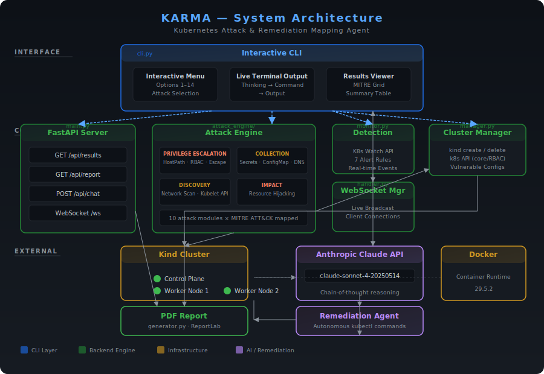

# KARMA — Kubernetes Attack & Remediation Mapping Agent

A pure CLI tool that deploys a real Kind cluster, executes 10 real-world Kubernetes attack techniques mapped to MITRE ATT&CK for Containers, and autonomously remediates them using Claude Sonnet 4 — all with full transparency into every agent's reasoning, commands, and live output streamed to your terminal.


---

## Quick Start

```bash
git clone https://github.com/ritvikindupuri/k8attack.git
cd k8attack
pip install -r backend/requirements.txt
cp .env.example .env   # Optional: set ANTHROPIC_API_KEY for remediation
python3 cli.py
```

Select option **11** (Run All Attacks) to see the full workflow — no API key needed.

---

## Features

- **Real Kubernetes Cluster** — Creates a 3-node Kind cluster with intentionally vulnerable configurations
- **10 Real Attack Modules** — HostPath privilege escalation, RBAC escalation, container escape, sidecar injection, secrets exfiltration, configmap exfiltration, network scanning, kubelet API abuse, resource hijacking, DNS exfiltration
- **MITRE ATT&CK Mapping** — Every attack maps to specific tactics with a terminal-based coverage grid
- **AI-Powered Remediation** — Claude Sonnet 4 autonomously remediates incidents with full chain-of-thought reasoning
- **Agent Transparency** — Every agent shows: thinking → command → output, repeated for every step
- **Detection Monitoring** — Kubernetes watch-based detection (privileged pods, hostPath mounts, cluster-admin bindings, etc.)
- **PDF Report Generation** — Professional security assessment report via `/api/report`
- **Full Session History** — Every attack and remediation is saved to `results/`

---

## System Architecture

<div align="center">
  
  <p><em>Figure 1: KARMA System Architecture — component layers and data flow</em></p>
</div>

### Data Flow

1. **CLI → Attack Engine** — The user selects an attack from the interactive menu. The CLI imports backend components directly in-process (no HTTP needed for local operation) and streams live agent output to the terminal.

2. **API → Attack Engine** — The API routes the request to the Attack Engine, which instantiates the selected attack module and executes it against the Kind cluster via the Kubernetes Python client.

3. **Attack Engine → Cluster** — The attack module creates, modifies, or deletes Kubernetes resources (pods, ClusterRoleBindings, service accounts) in the Kind cluster. Every command and its output is captured and broadcast over WebSocket.

4. **Cluster → Detection Monitor** — The Detection Monitor watches the cluster in real-time using Kubernetes watch APIs. When a new resource matches an alert rule (privileged pod, hostPath mount, cluster-admin binding, etc.), it creates a detection event and broadcasts the alert.

5. **Detection → Remediation Agent** — For attacks with high or critical severity, the API queues the incident to the Remediation Agent. Claude Sonnet 4 receives the incident details plus recent detection events.

6. **Remediation Agent → Cluster** — The agent produces structured thinking blocks and kubectl commands. Each command is executed against the cluster, with output streamed back. The agent continues until a summary concludes the session.

7. **Results → CLI + Report** — All attack and remediation data is stored in memory, returned to the CLI for display, and available for PDF report generation via `/api/report`.

### Technical Documentation

For complete technical details including attack module internals, detection rule logic, remediation agent prompts, API reference, MITRE coverage tables, and data models, see the **[Technical Documentation](docs/technical-documentation.md)**.

---

## Interactive Menu

| Option | Mode | Description |
|--------|------|-------------|
| 1–10 | Single Attack | Run one specific attack module (auto-creates cluster if needed) |
| 11 | Run All Attacks | Execute all 10 attacks sequentially (auto-creates cluster if needed) |
| 12 | Full Engagement | All attacks + auto-remediation (auto-creates cluster; only option requiring `ANTHROPIC_API_KEY`) |
| 13 | View Results | Display latest engagement results with MITRE grid |
| 14 | Cluster Status | Live cluster info (nodes, pods, namespaces) |

### Attack Modules

| # | Attack | Severity | MITRE Tactic |
|---|--------|----------|-------------|
| 1 | Privilege Escalation via HostPath Mount | Critical | Privilege Escalation |
| 2 | RBAC Privilege Escalation | Critical | Privilege Escalation |
| 3 | Container Escape via Privileged Mode | Critical | Privilege Escalation |
| 4 | Sidecar Proxy Injection | High | Collection |
| 5 | Kubernetes Secrets Exfiltration | Critical | Credential Access |
| 6 | ConfigMap Data Collection | Medium | Collection |
| 7 | Internal Cluster Network Scan | High | Discovery |
| 8 | Kubelet API Abuse | Critical | Privilege Escalation |
| 9 | Cluster Resource Hijacking | High | Impact |
| 10 | DNS-Based Data Exfiltration | High | Collection |

---

## Setup

### Prerequisites

- macOS or Linux
- Git
- Docker (Desktop or Engine)
- Kind + kubectl
- Python 3.11+
- Anthropic API key (only for Full Engagement — optional; options 1–11, 13–14 work without it)

### Quickstart (macOS & Linux)

```bash
bash scripts/setup.sh      # installs kind, kubectl, pip deps, sets up .env
python3 cli.py              # launch the CLI
```

### macOS

```bash
# Install prerequisites
brew install kind kubectl python@3.11
brew install --cask docker

# Clone and set up
git clone https://github.com/ritvikindupuri/k8attack.git
cd k8attack
pip3 install -r backend/requirements.txt
cp .env.example .env

# Edit .env with your API key (only needed for option 12)
# Options 1–11, 13–14 work without it

# Launch
python3 cli.py
```

### Linux

```bash
# Install dependencies
sudo apt install python3-pip  # Debian/Ubuntu
# or: sudo dnf install python3-pip  # Fedora

# Install kind
curl -Lo ./kind https://kind.sigs.k8s.io/dl/v0.32.0/kind-linux-amd64
chmod +x ./kind && sudo mv ./kind /usr/local/bin/

# Install kubectl
curl -LO "https://dl.k8s.io/release/v1.30.0/bin/linux/amd64/kubectl"
chmod +x kubectl && sudo mv kubectl /usr/local/bin/

# Clone and set up
git clone https://github.com/ritvikindupuri/k8attack.git
cd k8attack
pip3 install -r backend/requirements.txt
cp .env.example .env

# Edit .env with your API key (only needed for option 12)

# Launch
python3 cli.py
```

### Windows (PowerShell)

```powershell
# Install prerequisites (Docker Desktop, Python, kind via curl)
git clone https://github.com/ritvikindupuri/k8attack.git
cd k8attack
pip install -r backend/requirements.txt
cp .env.example .env
# Edit .env with your API key (only needed for option 12)

# Launch
python3 cli.py
```

---

## Usage

### Run the interactive CLI

```bash
python3 cli.py
```

This launches the menu. Select an option and watch agents execute in real-time.

### Run a single attack

```bash
python3 cli.py
# Then select a number 1-10
```

Each attack streams:
1. **Agent Thinking** — What the agent plans to do and why
2. **Command** — The exact kubectl command being executed
3. **Output** — The raw command output

### Run all attacks

Select option **11** in the menu. All 10 attacks run sequentially with live streaming output.

### Full engagement with remediation

Set `ANTHROPIC_API_KEY` in `.env` (see `.env.example`) and select option **12** (the only option that requires it). After each high/critical attack, Claude autonomously remediates the incident. Options 1–11 and 13–14 work without any API key.

### View results

Select option **13** to see a terminal-based summary including:
- Attack success/failure counts by severity
- MITRE ATT&CK coverage grid — shows `(covered/total)` techniques per tactic. For example, `Privilege Escalation` maps to 2 techniques (T1611 Container Escape, T1548.003 Abuse Elevation Control Mechanism). Before running those attacks it shows `(0/2)`, after they execute it becomes `(2/2)`.
- Agent execution timeline with step counts
- Per-attack infrastructure details

### Check cluster status

Select option **14** to see nodes, pods, services, and resource capacity.

---

## Remediation

When `ANTHROPIC_API_KEY` is set (via `.env` or environment), the Full Engagement mode triggers Claude Sonnet 4 after each high/critical severity attack. The remediation agent:

1. **Analyzes** the incident with structured chain-of-thought (situation, risk, strategy)
2. **Generates** kubectl commands to remove malicious resources and harden configurations
3. **Executes** commands autonomously against the cluster
4. **Verifies** each command succeeded
5. **Summarizes** all actions taken and provides hardening recommendations

Remediation agents appear as nodes in the execution workflow alongside attack agents.

---

## API

The FastAPI backend runs on port 8000 and provides 28 endpoints:

| Endpoint | Method | Description |
|----------|--------|-------------|
| `/api/health` | GET | Health check |
| `/api/prerequisites` | GET | Check prerequisite tools |
| `/api/cluster/info` | GET | Cluster info (nodes, pods) |
| `/api/cluster/create` | POST | Create Kind cluster |
| `/api/cluster/create-and-attack` | POST | Create cluster and run attack |
| `/api/cluster/delete` | POST | Delete Kind cluster |
| `/api/cluster/setup-scenarios` | POST | Deploy vulnerable scenarios |
| `/api/attacks` | GET | List available attacks |
| `/api/attacks/mitre` | GET | MITRE ATT&CK mapping |
| `/api/attacks/run/{id}` | POST | Run specific attack |
| `/api/attacks/run-all` | POST | Run all attacks |
| `/api/attacks/history` | GET | Attack history |
| `/api/detection/events` | GET | Detection events |
| `/api/detection/start` | POST | Start monitoring |
| `/api/detection/stop` | POST | Stop monitoring |
| `/api/remediation/sessions` | GET | Remediation sessions |
| `/api/remediation/trigger` | POST | Trigger remediation |
| `/api/results` | GET | Latest results JSON |
| `/api/report` | GET | Download PDF report |
| `/api/chat` | POST | AI security chat |
| `/ws` | WebSocket | Real-time event stream |

See the **[Technical Documentation](docs/technical-documentation.md#6-api-reference)** for the complete list of all 28 endpoints.

Start the API server:

```bash
cd backend
python3 main.py
```

---

## License

For educational and security testing purposes only. Use responsibly and only on systems you own or have explicit permission to test.
