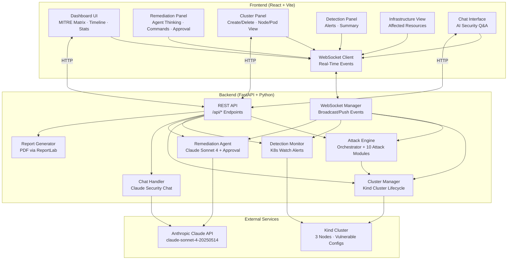

# K8s Attack Platform

A production-grade Kubernetes security assessment platform that deploys a real Kind cluster, executes 10 real-world attack techniques mapped to MITRE ATT&CK for Containers, and autonomously remediates them using Claude Sonnet 4 — all with full transparency into the AI agent's reasoning, command execution, and human-in-the-loop approval for every remediation action.


---

## Key Features

- **Real Kubernetes Cluster** — Creates a 3-node Kind cluster with intentionally vulnerable configurations
- **10 Real Attack Modules** — Privilege escalation, container escape, secrets exfiltration, network scanning, kubelet API abuse, resource hijacking, DNS exfiltration, and more
- **MITRE ATT&CK Mapping** — Every attack maps to specific tactics and techniques with a live interactive matrix
- **AI-Powered Remediation** — Claude Sonnet 4 analyzes each incident, produces structured chain-of-thought reasoning, and generates kubectl commands
- **Human-in-the-Loop Approval** — Every remediation command requires explicit `allow`/`reject` input before execution — no autonomous command execution
- **Real-Time WebSocket Dashboard** — Live attack progress, infrastructure changes, detection alerts, and event feed
- **Detection Monitoring** — Kubernetes watch-based detection (privileged pods, hostPath mounts, cluster-admin bindings, etc.)
- **AI Security Chat** — Ask Claude natural language questions about your cluster's security posture
- **PDF Report Generation** — Professional security assessment report with executive summary, attack timeline, MITRE coverage, detection log, and remediation actions
- **Full Session History** — Every attack and remediation session is stored and browsable

---

## System Architecture



<p align="center"><strong>Figure 1: K8s Attack Platform System Architecture</strong></p>

### Component Breakdown

**Frontend Layer**
- **Dashboard UI** — Central real-time hub with six panels: attack stats, MITRE ATT&CK matrix, attack progress timeline, infrastructure view, detection alerts (filterable by severity), and a live event feed. Every panel has info tooltips explaining what you're seeing.
- **Remediation Panel** — Full AI agent transparency. Left sidebar lists remediation sessions; right panel shows the agent's chain-of-thought (Situation Assessment, Risk Analysis, Remediation Strategy, Command Justification, Verification Plan), the proposed kubectl command, a text input where you type `allow` or `reject`, and the command output after execution.
- **Cluster Panel** — Create and delete the Kind cluster, view nodes and pods with their status, IPs, and resource capacity.
- **Detection Panel** — Start/stop detection monitoring, view alert summary by severity (Critical/High/Medium/Low), and scroll through individual detection events.
- **Chat Interface** — Ask natural language questions about your cluster's security posture. Claude responds with structured analysis including tables and code blocks.
- **WebSocket Client** — Custom hook with auto-reconnect (`useWebSocket`) that subscribes to all server-pushed events and updates UI state in real-time.

**Backend Layer**
- **REST API** — FastAPI application serving 20+ endpoints for cluster management, attack execution, detection control, remediation sessions, chat, and PDF report generation. All endpoints prefixed with `/api/`.
- **WebSocket Manager** — Manages connected clients, broadcasts real-time events (attack lifecycle, detection alerts, cluster state, remediation progress) to all connected browsers.
- **Attack Engine** — Orchestrates 10 attack modules, each implementing `BaseAttack` with MITRE tactic/technique mappings. Attacks run sequentially with configurable pauses. Each attack produces structured events (info, warning, error, cmd, detected, critical) and infrastructure change records.
- **Cluster Manager** — Wraps `kind` CLI and `kubernetes` Python client. Creates a 3-node cluster (1 control-plane + 2 workers) with port mappings and networking. Applies vulnerable configurations (privileged SA, wide RBAC bindings, demo secrets/configmaps) as attack targets.
- **Detection Monitor** — Uses Kubernetes watch API to monitor pods and RBAC changes in real-time. Seven alert rules detect privileged pods, hostPath mounts, cluster-admin bindings, secret access, API discovery, host network, and host PID.
- **Remediation Agent** — When a high/critical attack completes, creates a remediation session. Sends the attack details to Claude Sonnet 4 with a structured prompt requiring specific analysis sections. Parses Claude's streaming response for thinking blocks and command blocks. Each command requires `allow`/`reject` via WebSocket before execution (60s timeout, auto-rejected if no response). Commands execute via `subprocess.run` against the cluster.
- **Chat Handler** — Builds a snapshot of the entire platform state (attacks, alerts, cluster info, remediation sessions, MITRE coverage, infrastructure) and sends it as context with the user's question to Claude.
- **Report Generator** — Uses ReportLab to build a multi-page PDF with cover page, executive summary, attack summary table, MITRE coverage grid, detailed attack logs, detection/remediation sections, and recommendations.

**External Layer**
- **Anthropic Claude API** — `claude-sonnet-4-20250514` model for both remediation analysis and chat. API key configured via `ANTHROPIC_API_KEY` environment variable.
- **Kind Cluster** — Local Kubernetes cluster running in Docker. Three nodes (1 control-plane + 2 workers) with intentionally vulnerable resources pre-deployed.

---

## Tech Stack

| Layer | Technology | Version |
|-------|-----------|---------|
| **Frontend** | React | 18.3.1 |
| | TypeScript | 5.5.3 |
| | Vite | 5.4.7 |
| | Tailwind CSS | 3.4.0 |
| | Recharts | 2.12.0 |
| **Backend** | Python | 3.11+ |
| | FastAPI | 0.100+ |
| | Uvicorn | 0.20+ |
| | WebSockets | 10.0+ |
| | Kubernetes Python Client | 25.0+ |
| | Anthropic SDK | latest |
| | ReportLab | latest |
| **Cluster** | Kind (Kubernetes in Docker) | 0.32.0 |
| | Docker | 29.5.2 |
| | Kubectl | latest |
| **AI** | Claude Sonnet 4 | claude-sonnet-4-20250514 |

---

## Setup Instructions

### Prerequisites

- A computer running **macOS** or **Windows**
- **Git** installed ([Download Git](https://git-scm.com/downloads))
- Stable internet connection
- An **Anthropic API key** with credits ([console.anthropic.ai](https://console.anthropic.ai))

### macOS Setup

**Step 1: Clone the repository**

Open **Terminal** (Finder → Applications → Utilities → Terminal) and run:

```bash
git clone https://github.com/ritvikindupuri/k8attack.git
cd k8attack
```

**Step 2: Install Homebrew (if not installed)**

Paste this in Terminal and press Enter:

```bash
/bin/bash -c "$(curl -fsSL https://raw.githubusercontent.com/Homebrew/install/HEAD/install.sh)"
```

Follow the on-screen prompts. This may take a few minutes.

**Step 3: Install Docker**

Option A — Using Homebrew (recommended):

```bash
brew install --cask docker
```

Then open Docker from your Applications folder (**Finder → Applications → Docker**) and wait for it to show "Docker is running" in the menu bar.

Option B — Manual download: Go to [docker.com/products/docker-desktop](https://www.docker.com/products/docker-desktop), download the Mac installer, open the `.dmg` file, drag Docker into Applications, and launch it.

**Step 4: Install KinD and kubectl**

```bash
brew install kind kubectl
```

**Step 5: Install Python 3.11+ (if not installed)**

```bash
brew install python@3.11
```

**Step 6: Install Node.js and npm**

```bash
brew install node
```

Verify with:

```bash
node --version   # Should show v18 or higher
npm --version    # Should show v9 or higher
```

**Step 7: Set up the Python backend**

```bash
cd backend
python3 -m venv venv
source venv/bin/activate
pip install -r requirements.txt
pip install anthropic reportlab
cd ..
```

**Step 8: Set up the frontend**

```bash
cd frontend
npm install
cd ..
```

**Step 9: Set your Anthropic API key**

```bash
export ANTHROPIC_API_KEY="sk-ant-api03-your-key-here"
```

> To make this permanent, add the line above to your `~/.zshrc` file (or `~/.bash_profile`).

**Step 10: Start the backend**

Open a new Terminal window/tab:

```bash
cd k8attack/backend
source venv/bin/activate
export ANTHROPIC_API_KEY="sk-ant-api03-your-key-here"
python main.py
```

You should see: `Uvicorn running on http://0.0.0.0:8000`

**Step 11: Start the frontend**

Open another new Terminal window/tab:

```bash
cd k8attack/frontend
npm run dev
```

You should see: `VITE v5.x.x ready in ... ➜ Local: http://localhost:3000`

**Step 12: Open the app**

Open Chrome or any browser and go to **http://localhost:3000**

---

### Windows Setup

**Step 1: Clone the repository**

Open **PowerShell** (right-click Start menu → Windows PowerShell / Terminal) and run:

```bash
git clone https://github.com/ritvikindupuri/k8attack.git
cd k8attack
```

**Step 2: Install Docker Desktop**

Go to [docker.com/products/docker-desktop](https://www.docker.com/products/docker-desktop), download the Windows installer, and run it. Make sure **WSL 2 backend** is selected during installation (it should be the default).

After installation, restart your computer. Launch Docker Desktop from the Start menu and wait for it to show "Docker Desktop is running" in the bottom-left.

**Step 3: Install kubectl**

Open PowerShell (as Administrator) and run:

```bash
curl.exe -LO "https://dl.k8s.io/release/v1.30.0/bin/windows/amd64/kubectl.exe"
```

Move `kubectl.exe` to a folder in your PATH (like `C:\Windows\System32\`) or add its location to PATH.

**Step 4: Install KinD**

In PowerShell (as Administrator):

```bash
curl.exe -Lo kind-windows-amd64.exe https://kind.sigs.k8s.io/dl/v0.32.0/kind-windows-amd64
Move-Item .\kind-windows-amd64.exe C:\Windows\System32\kind.exe
```

**Step 5: Install Python 3.11+**

Go to [python.org/downloads](https://www.python.org/downloads/), download the Windows installer, and run it.

**Important:** Check **"Add Python to PATH"** at the bottom of the installer screen before clicking Install.

After installation, open a new PowerShell window and verify:

```bash
python --version   # Should show Python 3.11.x
```

**Step 6: Install Node.js and npm**

Go to [nodejs.org](https://nodejs.org/), download the **LTS** installer (18.x or 20.x), and run it.

Open a new PowerShell window and verify:

```bash
node --version   # Should show v18 or higher
npm --version    # Should show v9 or higher
```

**Step 7: Set up the Python backend**

```bash
cd backend
python -m venv venv
.\venv\Scripts\activate
pip install -r requirements.txt
pip install anthropic reportlab
cd ..
```

**Step 8: Set up the frontend**

```bash
cd frontend
npm install
cd ..
```

**Step 9: Set your Anthropic API key**

```bash
$env:ANTHROPIC_API_KEY="sk-ant-api03-your-key-here"
```

> To make this permanent: Search for "Environment Variables" in Windows settings, click "Environment Variables", add a new **System Variable** with name `ANTHROPIC_API_KEY` and your key as the value.

**Step 10: Start the backend**

Open a new PowerShell window:

```bash
cd k8attack\backend
.\venv\Scripts\activate
$env:ANTHROPIC_API_KEY="sk-ant-api03-your-key-here"
python main.py
```

You should see: `Uvicorn running on http://0.0.0.0:8000`

**Step 11: Start the frontend**

Open another new PowerShell window:

```bash
cd k8attack\frontend
npm run dev
```

You should see: `VITE v5.x.x ready in ... ➜ Local: http://localhost:3000`

**Step 12: Open the app**

Open Chrome, Edge, or any browser and go to **http://localhost:3000**

---

## How to Use This Application

### 1. First Launch

When you open the app at `http://localhost:3000`, you'll see a **clean dashboard** — no data, no cluster, no attacks. Everything starts empty.

### 2. Create the Cluster

1. Click the **"Deploy Cluster & Run Attacks"** button in the top-right area, or go to the cluster panel
2. The platform will:
   - Check prerequisites (Docker, kind, kubectl)
   - Create a 3-node Kind cluster named `k8s-attack-lab`
   - Apply intentionally vulnerable configurations (privileged service accounts, demo secrets/configmaps, wide RBAC bindings)
   - Start the detection monitor

You'll see the cluster info panel update in real-time showing nodes, pods, and services.

### 3. Run Attacks

You have two options:

**Option A — Run all attacks (recommended):**
1. Click **"Execute All"** in the attack library section
2. The platform runs all 10 attacks sequentially with 2-second pauses
3. Each attack appears in the timeline with live streaming command output and event logs
4. The MITRE ATT&CK matrix lights up in real-time as each attack completes

**Option B — Run individual attacks:**
1. Browse the Attack Library section
2. Click **"Execute"** on any individual attack

**Available attacks:**
| Attack | Severity | MITRE Tactic | What It Does |
|--------|----------|-------------|-------------|
| HostPath Privilege Escalation | Critical | Privilege Escalation | Pod with hostPath mount to `/` reads `/etc/shadow` |
| RBAC Privilege Escalation | Critical | Privilege Escalation | ServiceAccount bound to cluster-admin extracts token |
| Container Escape (Privileged) | Critical | Privilege Escalation | Privileged pod with hostPID escapes via nsenter |
| Sidecar Injection | High | Collection | HostNetwork proxy pod intercepts traffic |
| Secrets Exfiltration | Critical | Credential Access | Enumerates and decodes all secrets cluster-wide |
| ConfigMap Exfiltration | Medium | Collection | Extracts all ConfigMap data |
| Internal Network Scan | High | Discovery | Scanner pod probes internal cluster CIDR |
| Kubelet API Abuse | Critical | Privilege Escalation | Discovers and abuses unauthenticated kubelet APIs |
| Resource Hijacking | High | Impact | CPU-intensive pods simulating cryptominers |
| DNS-Based Exfiltration | High | Collection | DNS queries encoding stolen data (tunneling) |

### 4. Monitor in Real-Time

While attacks run, the Dashboard shows you everything happening:

- **Attack Stats** — Total attacks, currently running count, completed count, failed count
- **MITRE ATT&CK Matrix** — All 10 tactics shown as clickable boxes (gray = not yet covered, green = covered by a completed attack). Click any box to open the MITRE ATT&CK page for that technique.
- **Attack Progress List** — Each attack shows its name, severity badge (color-coded), status, and expandable logs. Click an attack to see the detailed terminal-style output with timestamps.
- **Infrastructure Panel** — Every resource created or modified by an attack appears as a card with type, name, namespace, and attack linkage.
- **Detection Alerts** — Filterable by severity (All/Critical/High/Medium/Low). Each alert shows the rule that fired, a description, timestamp, and the affected resource.
- **Event Feed** — Scrolling live feed of every event: attacks starting/completing, infrastructure changes, detection alerts, and errors.

### 5. AI Remediation

After an attack completes (High or Critical severity), the platform automatically triggers AI remediation. Switch to the **"AI Remediation"** tab.

**What you'll see:**

1. **Session list** (left sidebar) — Each attack that triggered remediation is listed with its status
2. **Agent Thinking** — Claude's chain-of-thought structured into five sections:
   - **Situation Assessment** — What happened and what's affected
   - **Risk Analysis** — Severity and blast radius assessment
   - **Remediation Strategy** — Approach to fixing the issue
   - **Command Justification** — Why each kubectl command is needed
   - **Verification Plan** — How to verify the fix worked
3. **Command with Approval Prompt** — A kubectl command is shown with a text input. You must type **`allow`** to execute the command or **`reject`** to skip it.
4. **Command Output** — If you approve, the command runs against the cluster and the output appears below (green = success, red = error).
5. **Remediation Summary** — After all commands are processed, Claude provides a summary of what was done.

> **Note:** You have 60 seconds to respond before the command auto-skips. Each command in a session requires separate approval.

### 6. Chat with AI Security Assistant

Click the chat button/icon to open the AI security chat. You can ask questions like:
- "What attacks were executed on my cluster?"
- "What vulnerabilities were found?"
- "Summarize the detection events"
- "What's the current state of the cluster?"
- "Show me the MITRE coverage"

Claude has full context of the platform state and responds with structured analysis.

### 7. Generate a Report

Click the **"Generate Report"** button in the top-right area. The backend generates a comprehensive PDF report with:

- Cover page with cluster stats and severity distribution
- Executive summary
- Attack summary table (attack name, severity, status, MITRE technique)
- MITRE ATT&CK coverage grid
- Detailed attack logs with events and infrastructure changes
- Detection and alert summary
- Remediation actions taken
- Conclusion with recommendations

The report downloads automatically.

### 8. Clean Up

To delete the cluster and all resources:

1. Click the **"Delete Cluster"** button (or use the cluster panel)
2. This runs `kind delete cluster k8s-attack-lab`
3. Close the browser tabs

To stop the servers, press **Ctrl+C** in the terminal windows running the backend and frontend.

---

## Project Structure

```
k8attack/
├── backend/
│   ├── main.py                  # FastAPI app, REST endpoints, WebSocket handler
│   ├── requirements.txt         # Python dependencies
│   ├── attack_engine/
│   │   ├── engine.py            # Attack lifecycle management
│   │   ├── mitre.py             # MITRE ATT&CK tactic/technique definitions
│   │   ├── orchestrator.py      # Sequential attack runner
│   │   └── attacks/
│   │       ├── base.py          # BaseAttack abstract class, event system
│   │       ├── privilege_escalation.py   # HostPath + RBAC escalation
│   │       ├── container_escape.py       # Privileged container escape
│   │       ├── secrets_access.py          # Secrets + ConfigMap exfiltration
│   │       ├── network_scan.py           # Internal scanning + Kubelet API
│   │       ├── resource_hijack.py        # CPU resource hijacking
│   │       └── dns_exfiltration.py       # DNS tunneling exfiltration
│   ├── chat/
│   │   └── handler.py           # AI security chat with Claude
│   ├── cluster_manager/
│   │   └── manager.py           # Kind cluster lifecycle
│   ├── detection/
│   │   └── monitor.py           # K8s watch-based detection
│   ├── remediation/
│   │   └── agent.py             # Claude remediation agent with approval
│   ├── report/
│   │   └── generator.py         # PDF report generation
│   └── ws_manager/
│       └── handler.py           # WebSocket connection manager
├── frontend/
│   ├── index.html               # Entry HTML
│   ├── vite.config.ts           # Vite config with proxy
│   ├── package.json             # Frontend dependencies
│   ├── tailwind.config.js       # Tailwind config
│   └── src/
│       ├── main.tsx             # React entry point
│       ├── App.tsx              # Main app, WebSocket handler, routing
│       ├── hooks/
│       │   └── useWebSocket.ts  # WebSocket hook with auto-reconnect
│       └── components/
│           ├── Dashboard.tsx    # Main dashboard with all panels
│           ├── RemediationPanel.tsx  # AI remediation interface
│           ├── AttackLibrary.tsx     # Attack library with execute buttons
│           ├── AttackTimeline.tsx    # Attack progress list
│           ├── MitreMatrix.tsx       # MITRE ATT&CK matrix
│           ├── ClusterView.tsx       # Cluster management panel
│           ├── DetectionPanel.tsx    # Detection monitoring
│           ├── InfrastructureView.tsx # Affected resources
│           └── RealTimeLog.tsx       # Live event feed
└── scripts/
    └── setup.sh                # Automated setup script (macOS/Linux)
```

---

## WebSocket Event Reference

The platform uses WebSocket for all real-time communication. Here are the key events:

| Event Type | Direction | Description |
|-----------|-----------|-------------|
| `connected` | Server → Client | Initial connection confirmation |
| `cluster_creating` / `cluster_ready` / `cluster_error` / `cluster_deleted` | Server → Client | Cluster lifecycle |
| `attack_started` / `attack_completed` / `attack_failed` | Server → Client | Attack lifecycle |
| `attack_event` | Server → Client | Individual attack log event |
| `infrastructure_affected` | Server → Client | Resource created/modified |
| `detection_alert` | Server → Client | Detection monitor alert |
| `orchestrator_started` / `orchestrator_completed` | Server → Client | Orchestrator status |
| `remediation_started` / `remediation_stream` / `remediation_command_found` / `remediation_approval_required` / `remediation_command_approved` / `remediation_command_result` / `remediation_completed` / `remediation_failed` | Server → Client | Remediation lifecycle |
| `cluster_info` | Server → Client | Response to `get_cluster_info` |
| `remediation_approval` | Client → Server | User approves/rejects command |
| `ping` / `pong` | Bidirectional | Keep-alive |

---

## License

This project is for educational and security testing purposes only. Use responsibly and only on systems you own or have explicit permission to test.
